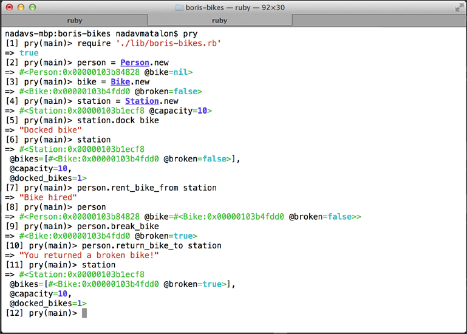
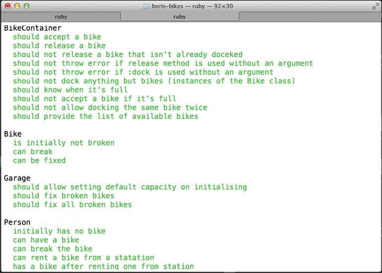

#Boris Bikes

##Table of Contents

* [Screenshots](#screenshots)
* [General Description](#general-description)
* [How to Run](#how-to-run)
* [Functional Description](#functional-description)
* [Testing](#testing)
* [License](#license)


##Screenshots

<table>
	<tr>
		<td align="center" width="200px">
			<a href="https://raw.githubusercontent.com/nadavmatalon/boris-bikes/master/images/boris_bikes_1.jpg">
				
			</a>
		</td>
		<td align="center" width="200px">
			<a href="https://raw.githubusercontent.com/nadavmatalon/boris-bikes/master/images/boris_bikes_2.jpg">
				
			</a>
		</td>
	</tr>
</table>


##General Description

This app was written during week 3 of the course at 
[Makers Academy](http://www.makersacademy.com/) and consists of a simple system simulation 
for managing [Boris Bikes](http://en.wikipedia.org/wiki/Barclays_Cycle_Hire) in London. 

The management system keeps track of a number of `bikes` and the `people` who rent them, 
as well as `docking stations`, `garages`, and `vans` to move them around.

The code was written in [Ruby](https://www.ruby-lang.org/en/) (2.1.1) according to 
[TDD](http://en.wikipedia.org/wiki/Test-driven_development) 
(testing done with [Rspec](http://rspec.info/)).


##How to Run

Clone the repo to a local folder and in terminal run:

```bash
$> cd boris-bikes
$> irb
>> require './lib/boris-bikes.rb'
```

You can now use the various methods described in the __Functional Description__ 
section below.


##Functional Description

The system's functionality includes:
* A __person__ can rent a bike and then return it to a __docking station__. 
* Occasionally a __bike__ may be __broken__ by a __person__ and then that __bike__
  becomes unavailable for rental (but can still be returned to a __docking station__).
* __Garages__ can fix __broken bikes__.
* __Vans__ move the __bikes__ between the __docking stations__ and __garages__.
* An implementation of a __bike-container__ module used by the __docking station__,
  __garage__, and __van__ classes.

After installation (see: [How to Run]((#how-to-run)) section below), the following methods 
are available for each class:

###Person

| Methods                   | Description                                                        |
|---------------------------|--------------------------------------------------------------------|
| Person.new                | Creates a new instance of a person                                 |
| .have_bike?               | returns boolean (true => has bike/s ; false => doesn't have bike/s |
| .break_bike               | breaks the person's bike                                           |
| .rent_bike_from (station) | rents a bike from a docking station                                |
| .return_bike_to (station) | returns the bike to a docking station                              |


###Bike

| Methods  | Description                                            |
|----------|--------------------------------------------------------|
| Bike.new | Creates a new instance of a bike                       |
| .broken? | returns boolean (true => broken ; false => not broken) |
| .brake!  | brakes the bike                                        |
| .fix!    | fixes the bike                                         |


###Station

| Methods          | Description                                                                     |
|------------------|---------------------------------------------------------------------------------|
| Station.new      | Creates a new instance of a docking station                                     |
| .bikes           | returns an array of all docked bikes                                            |
| .bike_count      | returns the number of currently docked bikes                                    |
| .capacity        | returns the max capacity of the station                                         |
| .capacity=       | sets the max capacity of the station                                            |
| .dock (bike)     | docks a bike in the station                                                     |
| .release (bike)  | releases a docked bike from the station                                         |
| .full?           | returns a boolean (true => station full ; false => station not full             |
| .available_bikes | returns an array of all available (i.e. not broken) bikes docked in the station |


###Garage

| Methods               | Description                                                                  |
|-----------------------|------------------------------------------------------------------------------|
| Garage.new            | Creates a new instance of a  garage                                          |
| .bikes                | returns an array of all bikes held in the garage                             |
| .bike_count           | returns the number of currently docked bikes                                 |
| .capacity             | returns the max capacity of the garage                                       |
| .capacity=            | sets the max capacity of the garage                                          |
| .dock (bike)          | docks a bike in the garage                                                   |
| .release (bike)       | releases a docked bike from the garage                                       |
| .fix (bike)           | fixes a bike (if broken)                                                     |
| .fix_all_broken_bikes | fixes all broken bikes currently held in the garage                          |
| .full?                | returns a boolean (true => garage full ; false => garage not full            |
| .available_bikes      | returns an array of all available (i.e. not broken) bikes held in the garage |


###Van

| Methods         | Description                                                 |
|-----------------|-------------------------------------------------------------|
| Van.new         | Creates a new instance of a van                             |
| .bikes          | returns an array of all bikes held in the van               |
| .bike_count     | returns the number of bikes in the van                      |
| .capacity       | returns the max capacity of the van                         |
| .capacity=      | sets the max capacity of the van                            |
| .dock (bike)    | docks a bike in the van                                     |
| .release (bike) | releases a docked bike from the van                         |
| .full?          | returns a boolean (true => van full ; false => van not full |


##Testing

Tests were written with [Rspec](http://rspec.info/) (3.1.7).

To run the tests in terminal: 

```bash
$> cd boris-bikes
$> rspec
```

##License

<p>Released under the <a href="http://www.opensource.org/licenses/MIT">MIT license</a>.</p>

